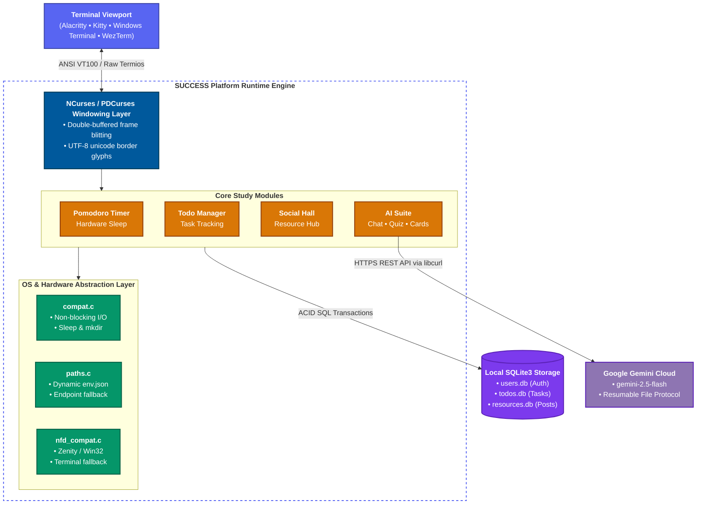

<div align="center">


<sub style="font-weight: bold;"> A Modern Cross-Platform Collaborative Learning & Study Environment powered by A.I  built for UCCians
1st year 1st semester finals project in ComProg I </sub>
</div>
<br><br>


An offline first terminal study suite ***made in pure C*** integrating proven learning methodologies (**Pomodoro**, **Active Recall**, **Spaced Repetition**) with local SQLite storage and Google Gemini generative intelligence.

---

## Tech Stack

[](https://en.wikipedia.org/wiki/C_(programming_language)) [](https://invisible-island.net/ncurses/) [](https://github.com/wmcbrine/PDCursesMod) [](https://en.wikipedia.org/wiki/Pthreads) [](https://ai.google.dev/) [](https://curl.se/) [](https://github.com/DaveGamble/cJSON) [](https://www.sqlite.org/) [](https://github.com/mlabbe/nativefiledialog) [](https://cmake.org/) [](https://www.gnu.org/software/make/) [](https://git-scm.com/) [](https://github.com/) [](https://neovim.io/) [](https://code.visualstudio.com/) [](https://www.gnu.org/software/gdb/) [](https://valgrind.org/)

---

## Architecture Overview

SUCCESS is engineered around a **Multi-Tier Decoupled Terminal Architecture (N-Tier Pattern)**. By separating display rendering from application domain logic, operating system syscalls, and network I/O, the codebase achieves complete cross-platform portability without compromising performance or code clarity.


---

## Project Structure

```
success/
├── CMakeLists.txt                                   # Root cross-platform CMake build configuration
├── env.json.example                                 # Template for Gemini API credential setup
├── .gitignore                                       # Version control ignore definitions
├── db/                                              # Local SQLite database directory (auto-created)
│   ├── users.db                                     # User accounts, credentials, and roles
│   ├── todos.db                                     # User task records and completion states
│   ├── resources.db                                 # Social Hall academic materials and notes
│   └── .session                                     # Active authentication session cache
├── include/                                         # Project headers
│   └── win32/                                       # Isolated Windows-specific SDK headers (PDCurses/pthreads)
├── src/                                             # Application source code
│   ├── Makefile                                     # GNU Makefile with automatic OS detection
│   ├── curses.c                                     # Main TUI application entry point
│   ├── main.c                                       # CLI fallback entry point
│   ├── callbacks/
│   │   └── write_callback.c                         # Memory buffer handler for libcurl streams
│   ├── features/
│   │   ├── ai_chat.c                                # Interactive AI academic chatbot
│   │   ├── flashcard.c                              # AI active recall flashcard generator
│   │   ├── quiz.c                                   # AI 20-question multiple choice exam maker
│   │   ├── social_hall.c                            # Student/Teacher resource sharing hub
│   │   ├── study_timer.c                            # Low-power Pomodoro countdown timer
│   │   └── todo.c                                   # SQLite todo and assignment tracker
│   ├── gemini_api/
│   │   ├── gemini_request.c                         # JSON payload builder & response parser
│   │   ├── get_file_uri.c                           # Multimodal attachment handler
│   │   └── get_upload_url.c                         # Google Resumable Media Upload protocol
│   ├── pages/
│   │   ├── introduction.c                           # Welcome splash, authentication, role routing
│   │   ├── menu.c                                   # Student / Teacher dashboard navigation
│   │   └── tools.c                                  # Academic tools selection sub-menu
│   ├── utils/
│   │   ├── compat.c / .h                            # Cross-platform primitives (sleep, kbhit, mkdir)
│   │   ├── paths.c / .h                             # Unified env.json & credential resolver
│   │   ├── nfd_compat.c                             # Native file dialog abstraction & CLI fallback
│   │   ├── get_file_mime_type.c                     # Document & image MIME detection
│   │   ├── read_file_b64.c                          # Base64 file encoder for attachments
│   │   └── grep_string.c                            # Safe HTTP header parser
│   └── vendor/
│       └── cjson/                                   # Vendored official MIT cJSON v1.7.19 parser
└── tests/
    └── test_suite.c                                 # Automated 39-case headless regression test harness
```

---

## Installing Tools and Dependencies

To build and run SUCCESS, you need a **C compiler (GCC or Clang)**, **CMake (or Make)**, **SQLite3**, **libcurl**, and **NCurses** (or **PDCurses** on Windows).

### Arch-based Distros (CachyOS / Arch / Manjaro)
```bash
sudo pacman -S base-devel cmake ncurses curl sqlite
```

### Debian / Ubuntu-based Distros
```bash
sudo apt update && sudo apt install -y build-essential cmake libncurses-dev libcurl4-openssl-dev libsqlite3-dev
```

### Fedora-based Distros
```bash
sudo dnf install -y gcc gcc-c++ cmake ncurses-devel libcurl-devel sqlite-devel
```

### macOS (Homebrew)
```bash
brew install cmake ncurses curl sqlite3
```

### Windows 10/11

The recommended approach for Windows is using **MSYS2** or modern package managers.

#### Option A: MSYS2 (MinGW-w64) — Recommended
Launch the **MSYS2 UCRT64** or **MINGW64** shell and run:
```bash
pacman -S mingw-w64-x86_64-gcc mingw-w64-x86_64-cmake mingw-w64-x86_64-pdcurses mingw-w64-x86_64-curl mingw-w64-x86_64-sqlite3
```

#### Option B: Winget
Install tools from PowerShell / CMD:
```powershell
winget install Kitware.CMake -e --accept-source-agreements
winget install LLVM.LLVM
winget install Git.Git
```

#### Option C: Scoop
```powershell
scoop install git cmake gcc curl sqlite
```

---

## Configuration (AI Features)

##### Prerequisites
To use the AI Chatbot, Quiz Generator, and Flashcard Generator, obtain a free Google Gemini API Key from **[Google AI Studio](https://aistudio.google.com/api-keys)**.

> [!IMPORTANT]
> Never commit or publicly share your API key. Keep `env.json` listed in `.gitignore`.

#### Method 1: Environment Variable (Recommended for quick testing)
```bash
export GEMINI_API_KEY="paste-your-gemini-api-key-here"
```

#### Method 2: Configuration File
Create an `env.json` file in the root project directory:
```json
{
  "GEMINI_API_KEY": "paste-your-gemini-api-key-here"
}
```

---

## Build and Run

### Building with CMake (Recommended)

1. Configure the build directory:
```bash
cmake -B build
```

2. Compile all targets:
```bash
cmake --build build
```

This compiles three executables into `build/`:
* `build/success`: Full interactive NCurses TUI application.
* `build/success_cli`: Command-line fallback interface.
* `build/test_suite`: Automated headless test runner.

### Alternative: Building with GNU Make
```bash
make -C src
```

---

## Running the Application

Launch the full interactive TUI:
```bash
./build/success
```

Execute the headless test harness to verify your installation:
```bash
./build/test_suite
```

> [!NOTE]
> For the best visual experience, ensure your terminal emulator supports UTF-8 and ANSI colors with a minimum resolution of **80 columns × 24 rows** (recommended: **100 × 30**).

---

## PROJECT PREVIEW

<p align="center">
<h3> video demo (v0.1.10) </h3>

https://github.com/user-attachments/assets/9222df74-09c8-4f65-a5b1-84c32ea21009

<h3> success terminal preview linux environment kitty terminal emulator (v0.1.10) </h3>


</p>
<!--
## PROJECT FLOWCHART


-->

---

## License
This project is licensed under the terms of the [GNU General Public License v3.0](LICENSE).
